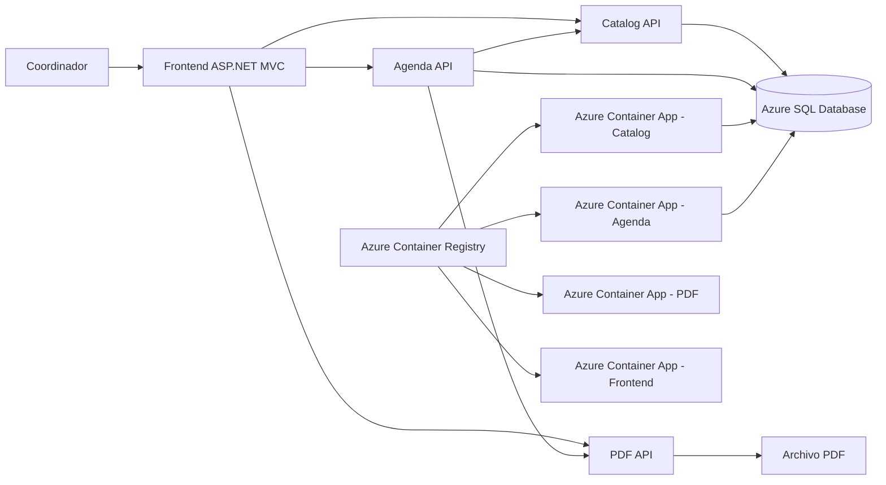
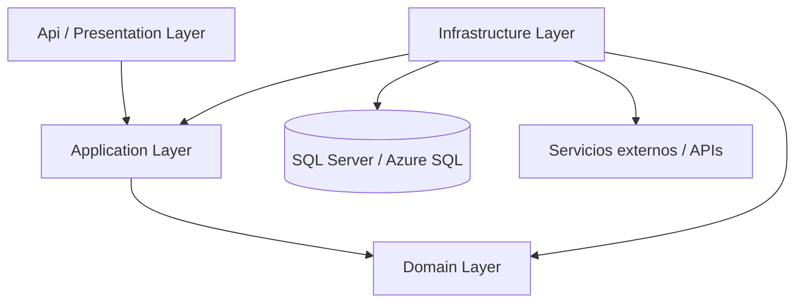
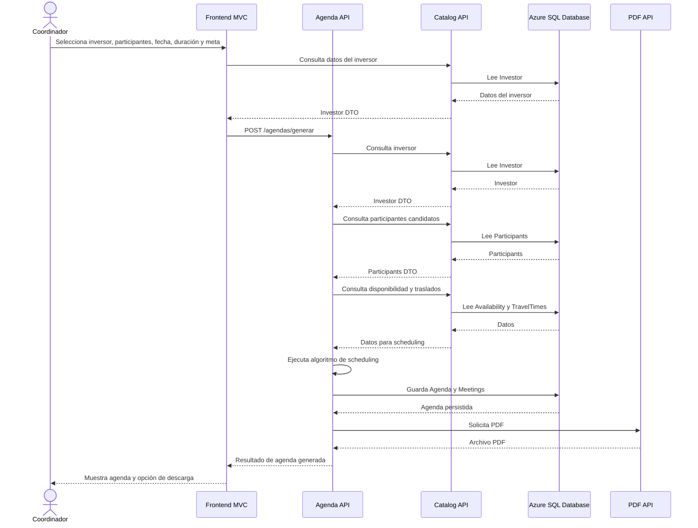
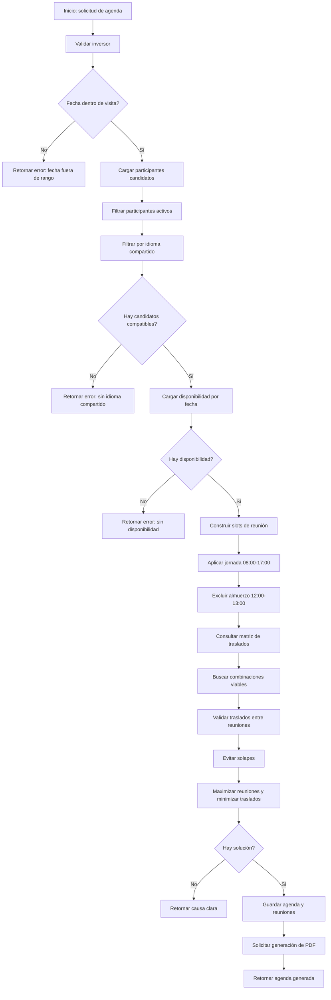
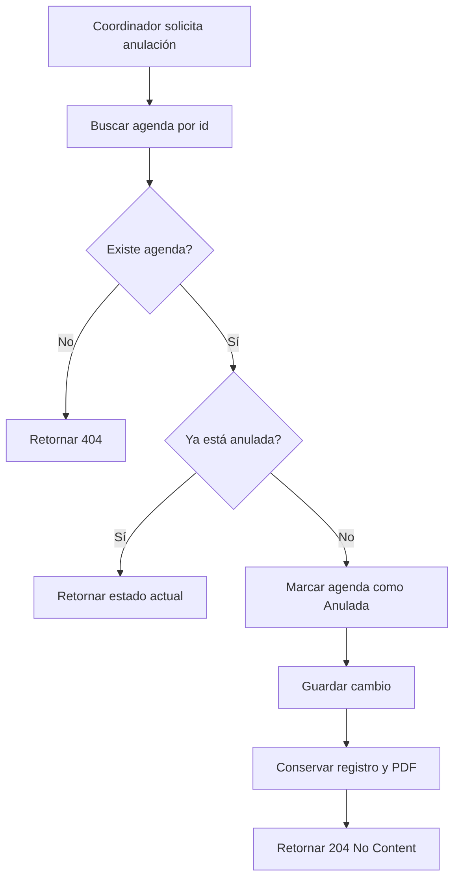
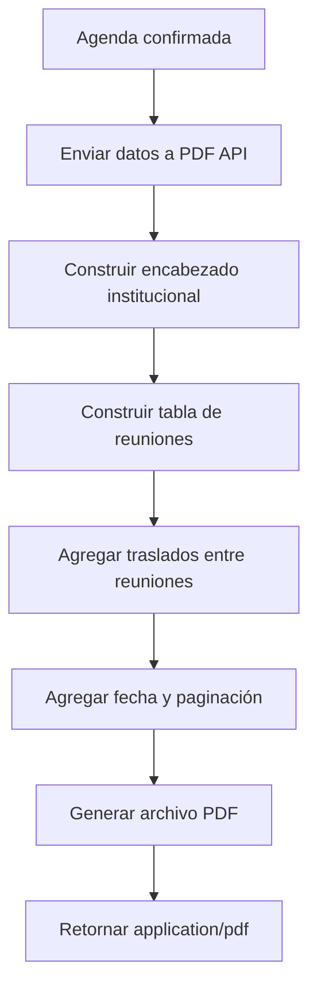
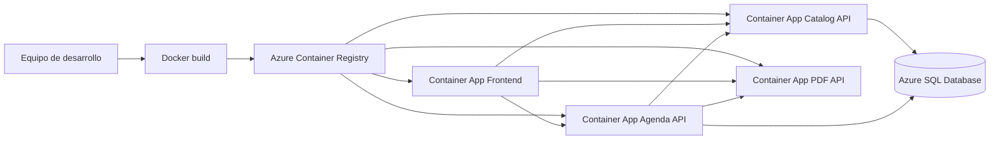

# 02 - Diagrama del proceso y arquitectura

## 1. Diagrama general de arquitectura



---

## 2. Diagrama de Clean Architecture por microservicio

Cada microservicio backend mantiene la siguiente estructura:



Reglas:

* Domain no depende de ninguna otra capa.
* Application depende de Domain.
* Infrastructure implementa contratos definidos en Application.
* Api expone endpoints REST y llama a Application.
* La base de datos es detalle de Infrastructure.
* HttpClient, EF Core, Dapper, QuestPDF y Polly son detalles técnicos de Infrastructure.

---

## 3. Flujo principal: generación de agenda



---

## 4. Flujo paso a paso del algoritmo de scheduling



---

## 5. Flujo de anulación de agenda



---

## 6. Flujo de generación de PDF



---

## 7. Comunicación entre microservicios

### Frontend hacia microservicios

```text
Frontend MVC -> Catalog API
Frontend MVC -> Agenda API
Frontend MVC -> PDF API
```

### Agenda API hacia otros servicios

```text
Agenda API -> Catalog API
Agenda API -> PDF API
```

### Persistencia

```text
Catalog API -> Azure SQL Database
Agenda API -> Azure SQL Database
```

### Generación de PDF

```text
PDF API -> Retorna archivo PDF
```

---

## 8. Despliegue en Azure



---

## 9. Resumen de componentes Azure

| Componente                      | Uso                                |
| ------------------------------- | ---------------------------------- |
| Azure Container Registry        | Almacenar imágenes Docker          |
| Azure Container Apps            | Ejecutar frontend y microservicios |
| Azure SQL Database              | Persistencia relacional            |
| Secrets / Environment variables | Connection strings y URLs          |
| Swagger público                 | Exploración y verificación de APIs |

---

## 10. Decisiones arquitectónicas

### Decisión 1: Microservicios desacoplados

Se separa Catálogo, Agendas y PDF porque tienen responsabilidades distintas:

* Catálogo administra datos maestros.
* Agendas ejecuta lógica de negocio compleja.
* PDF genera documentos.
* Frontend solo presenta información y consume APIs.

---

### Decisión 2: Clean Architecture

Cada backend se organiza por capas para separar reglas de negocio, casos de uso, detalles técnicos y presentación REST.

---

### Decisión 3: HttpClient tipado y resiliencia

Agenda API consume Catalog API y PDF API mediante HttpClient tipado, configurado con:

* Retry.
* Circuit breaker.
* Timeout.

Esto reduce fallos transitorios entre servicios.

---

### Decisión 4: SQL Server / Azure SQL Database

Se usa SQL Server para persistencia estructurada y trazabilidad.

---

### Decisión 5: PDF API separada

La generación de PDF queda aislada para mantener bajo acoplamiento y permitir cambios futuros en el formato del documento sin afectar el algoritmo de agendas.

---

### Decisión 6: Docker + Azure Container Apps

Cada componente se despliega como contenedor independiente, lo cual facilita escalabilidad, despliegue y separación operativa.
